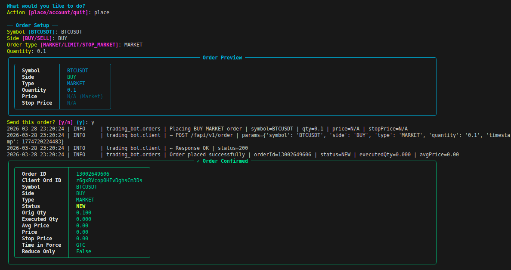
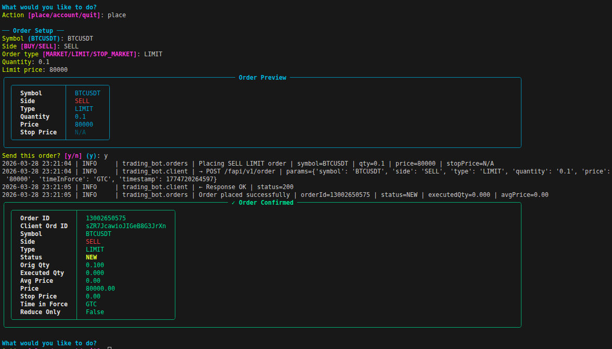

# Binance Futures Testnet Trading Bot

A Python CLI for placing orders on the [Binance Futures Testnet](https://testnet.binancefuture.com) (USDT-M perpetuals), with an enhanced Rich-powered interface.

---

## Features

| Category | Details |
|---|---|
| **Order types** | MARKET, LIMIT, STOP_MARKET |
| **Sides** | BUY, SELL |
| **CLI framework** | Click + Rich (interactive menus, coloured panels, rich tables) |
| **Interactive mode** | Run `python cli.py` with no args to get a guided menu prompt |
| **Auth** | HMAC-SHA256 signed requests |
| **Logging** | Rotating file log (`logs/trading_bot.log`) + coloured console |
| **Error handling** | Validation errors, API errors, network failures — all displayed in styled panels |
| **Structure** | Separated client / service / validation / CLI layers |

---

## Screenshots

**Interactive Menu → MARKET Order:**



**Interactive Menu → LIMIT Order:**



---

## Project Structure

```
trading_bot/
├── bot/
│   ├── __init__.py
│   ├── client.py          # Binance REST client (signing, session, logging)
│   ├── orders.py          # Order service layer (param building, formatting)
│   ├── validators.py      # Input validation (raises ValueError)
│   └── logging_config.py  # Rotating file + console logging setup
├── cli.py                 # Click + Rich CLI entry point
├── logs/                  # Auto-created; contains trading_bot.log + samples
├── requirements.txt
└── README.md
```

---

## Setup

### 1. Get Testnet credentials

1. Register / log in at <https://testnet.binancefuture.com>
2. Go to **API Management** and generate an API key + secret
3. Keep both values handy

### 2. Install dependencies

```bash
python -m venv .venv
source .venv/bin/activate        # Windows: .venv\Scripts\activate

pip install -r requirements.txt
```

### 3. Set credentials

**Option A — Environment variables (recommended)**

```bash
export BINANCE_API_KEY="your_api_key_here"
export BINANCE_API_SECRET="your_api_secret_here"
```

**Option B — CLI flags**

```bash
python cli.py --api-key YOUR_KEY --api-secret YOUR_SECRET place ...
```

---

## How to Run

All commands must be run from inside the `trading_bot/` directory.

```bash
cd trading_bot
```

### Interactive menu (no flags needed)

```bash
python cli.py
```

Launches a guided menu — prompts for action → symbol → side → type → quantity, then shows a rich preview before sending.

### Place a MARKET order

```bash
python cli.py place --symbol BTCUSDT --side BUY --type MARKET --quantity 1
```

### Place a LIMIT order

```bash
python cli.py place --symbol BTCUSDT --side SELL --type LIMIT --quantity 1 --price 80000
```

### Place a STOP_MARKET order

```bash
python cli.py place --symbol BTCUSDT --side SELL --type STOP_MARKET --quantity 1 --stop-price 75000
```

### View account balances

```bash
python cli.py account
```

### Increase log verbosity

```bash
python cli.py --log-level DEBUG place --symbol BTCUSDT --side BUY --type MARKET --quantity 1
```

### Skip interactive confirmation

```bash
echo "y" | python cli.py place --symbol BTCUSDT --side BUY --type MARKET --quantity 1
```

---

## CLI Reference

```
Usage: cli.py [OPTIONS] COMMAND [ARGS]...

  Binance Futures Testnet Trading Bot.

Options:
  --api-key TEXT              Binance API key (or BINANCE_API_KEY env var)
  --api-secret TEXT           Binance API secret (or BINANCE_API_SECRET env var)
  --log-level [DEBUG|INFO|WARNING|ERROR]
  --help                      Show this message and exit.

Commands:
  place    Place a new order on Binance Futures Testnet.
  account  Display Binance Futures account balances.
```

#### `place` options

| Flag | Required | Description |
|---|---|---|
| `--symbol` | ✓ | Trading pair, e.g. `BTCUSDT` |
| `--side` | ✓ | `BUY` or `SELL` |
| `--type` | ✓ | `MARKET`, `LIMIT`, or `STOP_MARKET` |
| `--quantity` | ✓ | Order quantity |
| `--price` | LIMIT only | Limit price |
| `--stop-price` | STOP_MARKET only | Stop trigger price |
| `--time-in-force` | No (default GTC) | `GTC`, `IOC`, `FOK` |
| `--reduce-only` | No | Flag – mark as reduce-only |

---

## Enhanced CLI UX

The bot uses [Rich](https://github.com/Textualize/rich) for a modern terminal experience:

- **Order Preview Panel** — shows a formatted table of your order before submission
- **Confirmation prompt** — coloured yes/no prompt before any order is sent
- **Order Response Panel** — green bordered table with full Binance response
- **Error Panels** — red bordered panels with Binance error code + message
- **Account Table** — colour-coded table of non-zero asset balances
- **Interactive mode** — `python cli.py` with no args launches a looping menu

---

## Logging

Log files are written to `logs/trading_bot.log` (auto-created).
The file rotates at 5 MB and keeps 3 backups.

```
2026-03-28 22:46:52 | INFO  | trading_bot.orders | Placing BUY MARKET order | symbol=BTCUSDT | qty=1 | price=N/A | stopPrice=N/A
2026-03-28 22:46:52 | INFO  | trading_bot.client | → POST /fapi/v1/order | params={...}
2026-03-28 22:46:52 | INFO  | trading_bot.client | ← Response OK | status=200
2026-03-28 22:46:52 | INFO  | trading_bot.orders | Order placed successfully | orderId=13002597867 | status=NEW
```

Sample log files from real testnet runs are in `logs/`:

| File | Description |
|---|---|
| `market_order_sample.log` | BUY MARKET qty=1, orderId 13002597867 |
| `limit_order_sample.log` | SELL LIMIT qty=1 @80000, orderId 13002598274 |
| `trading_bot.log` | Full session log including error cases |

---

## Assumptions

- Only USDT-M perpetual futures are targeted (endpoint: `/fapi/v1/order`).
- The testnet does not support all production features.
- `timeInForce` is only sent for `LIMIT` orders (Binance rejects it for MARKET).
- Credentials are **never** logged; only non-signature params are recorded.
- Minimum order notional on testnet is **$100** (use qty ≥ 0.002 for BTCUSDT).

---

## Error Handling

| Error type | Behaviour |
|---|---|
| Invalid CLI input | Red validation panel + exit code 1 |
| Binance API error | Red error panel with code + message + exit 1 |
| Network timeout | Clear message + exit 1 |
| Connection failure | Clear message + exit 1 |
| Unexpected exception | Full traceback in log file + short message on screen |
